# Swarm Orchestrato Architecture

This document provides a comprehensive overview of the Swarm Orchestrato architecture, including system layers, worker flows, dynamic scaling algorithms, and swarm topologies.

## Table of Contents

1. [System Overview](#system-overview)
2. [Worker Flow](#worker-flow)
3. [Dynamic Scaling](#dynamic-scaling)
4. [Swarm Topologies](#swarm-topologies)
5. [Key Components](#key-components)
6. [Memory Namespaces](#memory-namespaces)

---

## System Overview

The Swarm Orchestrato is a three-layer architecture that coordinates agent swarms through Claude Flow MCP.

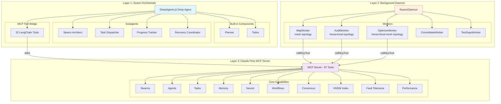

### Layer Responsibilities

| Layer | Component | Responsibility |
|-------|-----------|----------------|
| **Layer 1** | Swarm Orchestrato | High-level coordination, planning, task decomposition |
| **Layer 1** | Subagents | Specialized coordination (architecture, dispatch, tracking, recovery) |
| **Layer 2** | Background Daemon | Scheduled background workers for continuous analysis |
| **Layer 2** | Workers | Chunked parallel processing using swarm agents |
| **Layer 3** | Claude Flow MCP | Low-level swarm management, agent spawning, memory, consensus |

---

## Worker Flow

Workers follow a consistent pattern: gather files, chunk by directory, spawn swarm agents, process in parallel, and aggregate results.

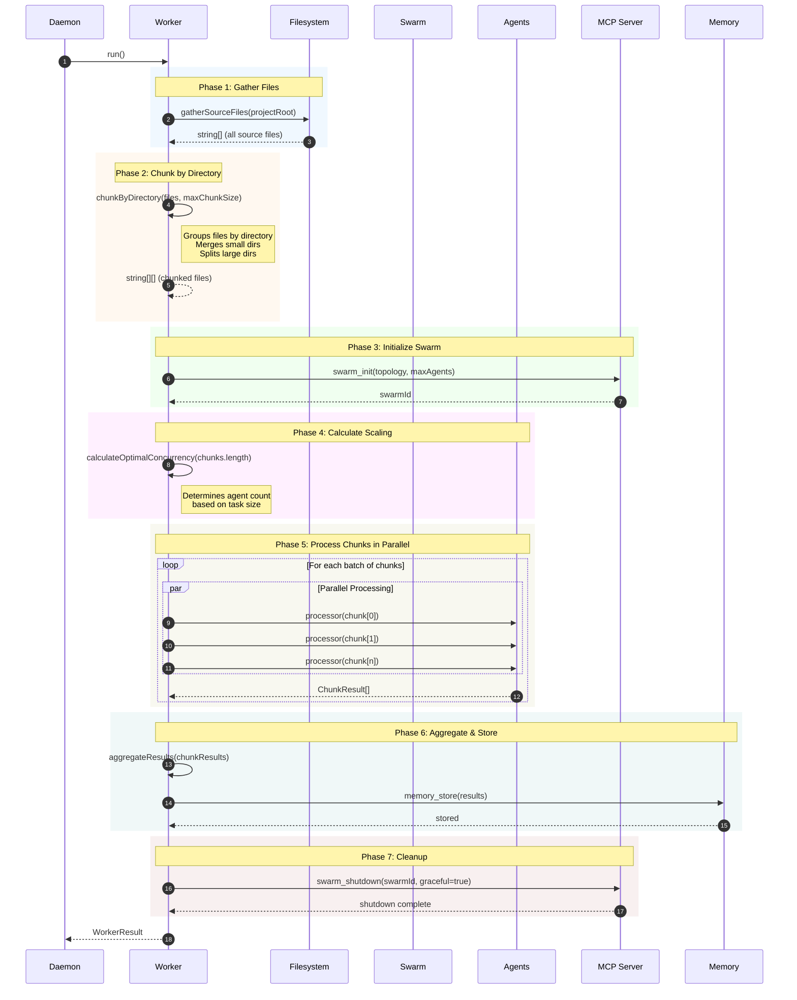

### Chunk Processing Detail

```mermaid
flowchart TD
    subgraph "chunkByDirectory Algorithm"
        A[Input: files array] --> B{Group files by<br/>directory path}
        B --> C[Map&lt;dir, files[]&gt;]

        C --> D{For each directory}
        D --> E{files.length ><br/>maxChunkSize?}

        E -->|Yes| F[Split into multiple chunks<br/>of maxChunkSize each]
        E -->|No| G{currentChunk.length +<br/>files.length > maxChunkSize?}

        G -->|Yes| H[Push currentChunk<br/>Start new chunk with files]
        G -->|No| I[Add files to currentChunk]

        F --> J[Add all split chunks]
        H --> K{More directories?}
        I --> K
        J --> K

        K -->|Yes| D
        K -->|No| L[Push final currentChunk]
        L --> M[Output: string[][] chunks]
    end

    style A fill:#e3f2fd
    style M fill:#e8f5e9
```

---

## Dynamic Scaling

The system dynamically calculates the optimal number of concurrent agents based on task size.

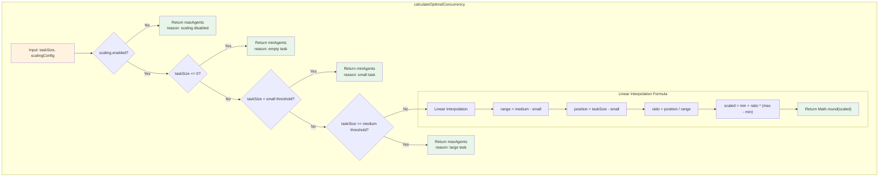

### Scaling Configuration

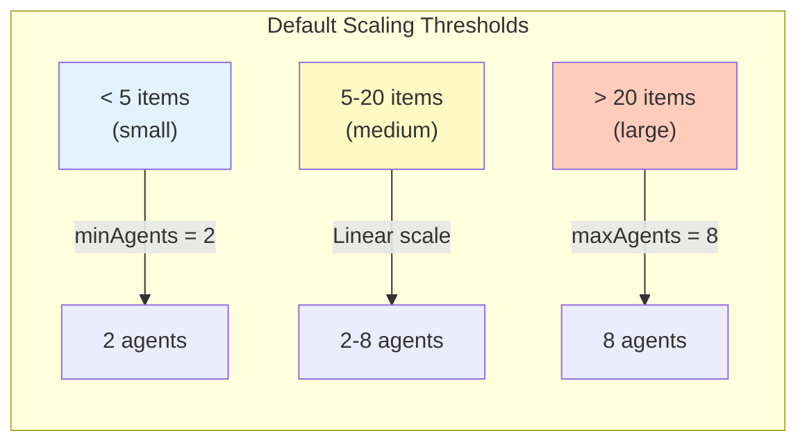

### Scaling Example Visualization

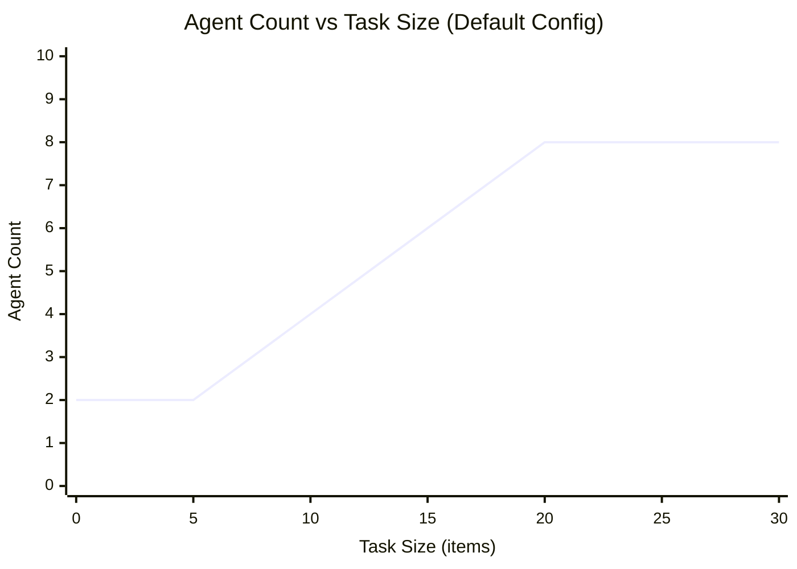

---

## Swarm Topologies

Different workers use different swarm topologies optimized for their specific workloads.

### Topology Overview

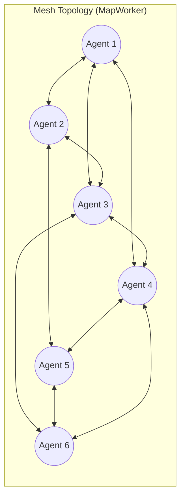

**Use Case**: Codebase mapping - peer-to-peer parallel file processing where agents work independently and can share discovered relationships.

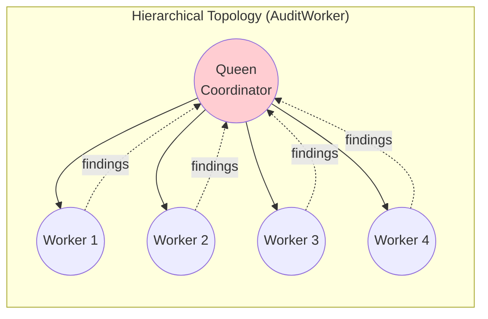

**Use Case**: Security audits - queen coordinates findings aggregation, ensures consistent severity ratings, and prevents duplicate detection.

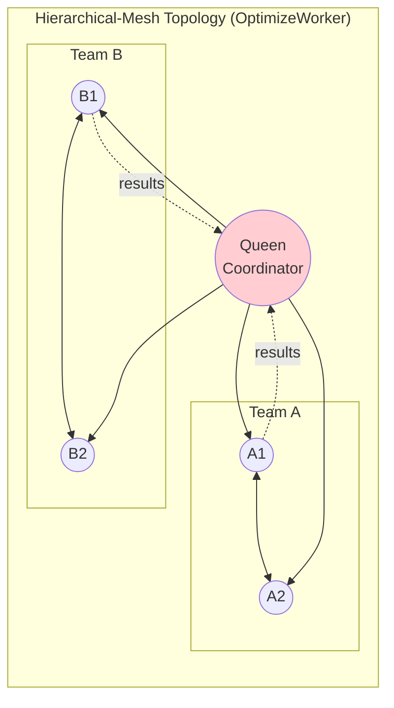

**Use Case**: Optimization analysis - combines top-down coordination with peer collaboration within teams for discussing complex refactoring decisions.

### Topology Selection Guide

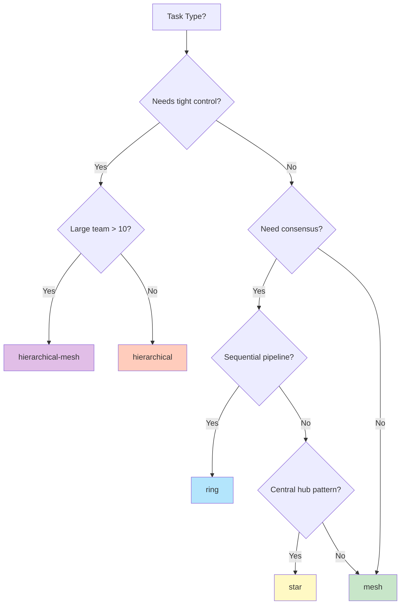

### Worker Topology Configuration

| Worker | Topology | Model | Max Concurrency | Chunk Timeout | Use Case |
|--------|----------|-------|-----------------|---------------|----------|
| **MapWorker** | `mesh` | haiku | 6 | 60s | Parallel file indexing |
| **AuditWorker** | `hierarchical` | sonnet | 4 | 180s | Security analysis with finding coordination |
| **OptimizeWorker** | `hierarchical-mesh` | sonnet | 4 | 120s | Complex refactoring decisions |

---

## Key Components

### `createSwarmWorker()` - Factory for Swarm-Based Workers

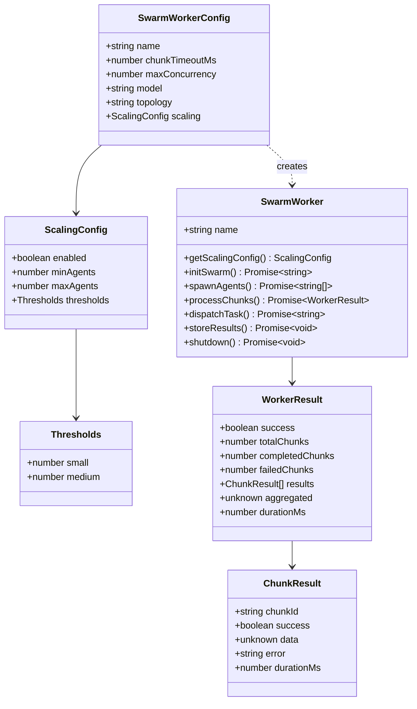

### `chunkByDirectory()` - File Chunking Strategy

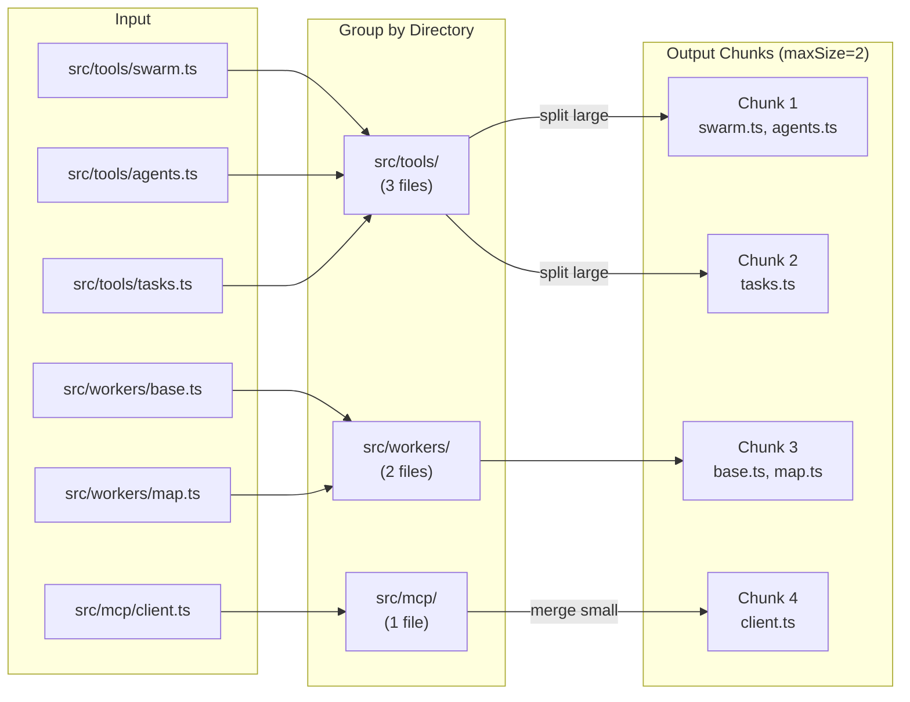

### `estimateAgentCount()` - Complexity-Based Estimation

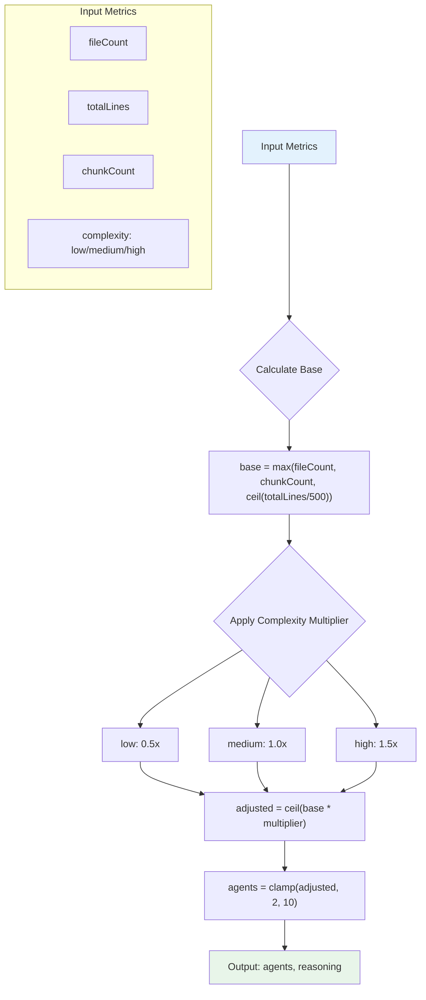

---

## Memory Namespaces

The system uses organized memory namespaces for persistent state management.

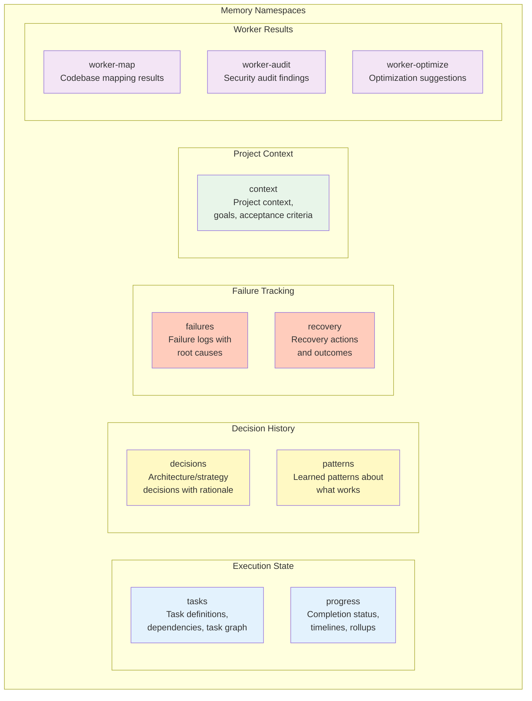

### Memory Flow

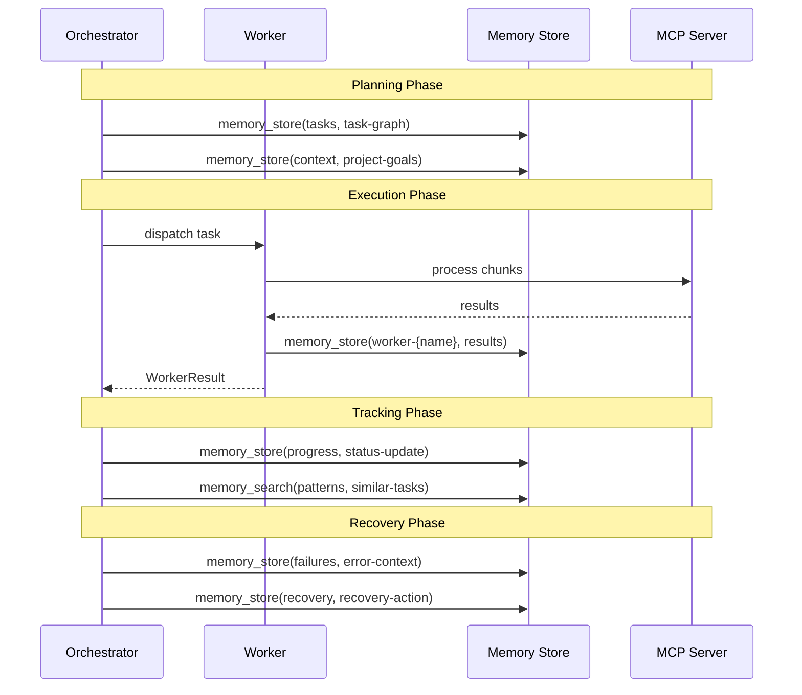

---

## Daemon Worker Schedule

The background daemon schedules workers with staggered offsets to prevent resource contention.

```mermaid
gantt
    title Worker Schedule (First 2 Hours)
    dateFormat mm:ss
    axisFormat %M:%S

    section Map Worker
    Initial Run (offset 0)     :active, map1, 00:00, 5m
    Recurring (15min)          :map2, 15:00, 5m
    Recurring                  :map3, 30:00, 5m
    Recurring                  :map4, 45:00, 5m
    Recurring                  :map5, 60:00, 5m
    Recurring                  :map6, 75:00, 5m
    Recurring                  :map7, 90:00, 5m
    Recurring                  :map8, 105:00, 5m

    section Audit Worker
    Initial Run (offset 2min)  :active, aud1, 02:00, 10m
    Recurring (30min)          :aud2, 32:00, 10m
    Recurring                  :aud3, 62:00, 10m
    Recurring                  :aud4, 92:00, 10m

    section Optimize Worker
    Initial Run (offset 5min)  :active, opt1, 05:00, 8m
    Recurring (30min)          :opt2, 35:00, 8m
    Recurring                  :opt3, 65:00, 8m
    Recurring                  :opt4, 95:00, 8m
```

---

## Data Flow Summary

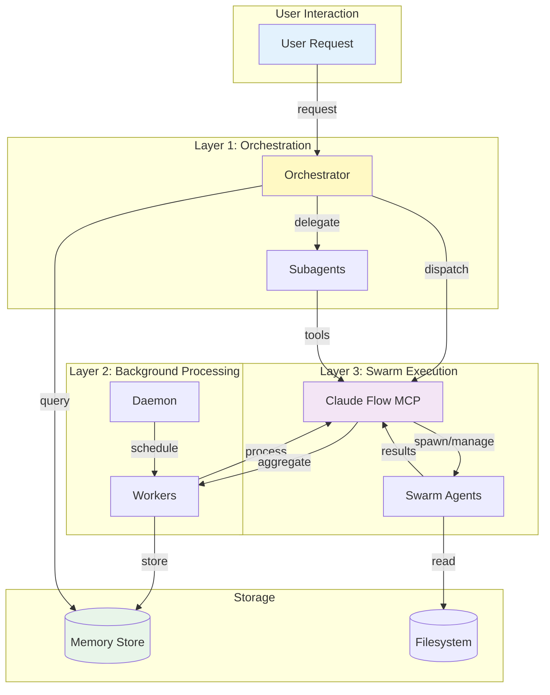

---

## References

- **Claude Flow Documentation**: https://claude-flow.ruv.io/
- **DeepAgents.js**: https://github.com/langchain-ai/deepagentsjs
- **MCP Protocol**: https://modelcontextprotocol.io/
